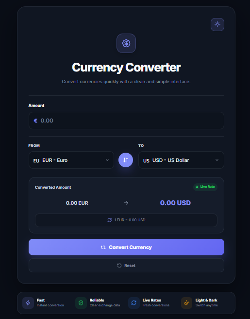

# 💱 Currency Converter PRO

A modern and responsive currency converter built with **HTML, CSS and Vanilla JavaScript**.

Currency Converter PRO allows users to convert between multiple currencies using live exchange rates through an external API.

## 🚀 Live Demo

🌐 **[Launch Currency Converter PRO]()**

## 📸 Preview

<p align="center">
  
</p>

## ✨ Features

- 💱 Live currency conversion
- 🌍 Multiple supported currencies
- 🔄 Swap currencies instantly
- 🚩 Dynamic currency flags
- 💰 Dynamic currency symbols
- ⚡ Real-time conversion
- 📊 Current exchange rate display
- 🔄 Reset converter
- 🌙 Dark / Light mode
- 💾 Theme persistence with LocalStorage
- 📱 Fully responsive design
- 🎨 Modern UI with Lucide icons

## 💵 Supported Currencies

- EUR — Euro
- USD — US Dollar
- GBP — British Pound
- CHF — Swiss Franc
- CZK — Czech Koruna
- PLN — Polish Zloty

## 🧠 How It Works

The application retrieves the current exchange rate for the selected currency pair.

The entered amount is multiplied by the exchange rate:

```js
const converted = amount * rate;
```

The result, currency information and current exchange rate are then dynamically displayed in the interface.

## 🌐 Exchange Rate API

Live exchange rates are retrieved using the Frankfurter API.

## 🛠️ Built With

- HTML5
- CSS3
- Vanilla JavaScript
- Fetch API
- Async / Await
- LocalStorage API
- Lucide Icons
- Frankfurter Exchange Rate API

## 💡 JavaScript Concepts

This project practices:

- DOM manipulation
- Event listeners
- Async / Await
- Fetch API
- Working with JSON
- API error handling
- Objects
- Dynamic object properties
- Application state
- Number conversion
- Currency calculations
- Dynamic UI updates
- Currency swapping
- LocalStorage
- Dark / Light theme handling

## 📱 Responsive Design

The interface is optimized for:

- Desktop
- Tablet
- Mobile

## 📂 Project Structure

```text
currency-converter-pro/
│
├── index.html
├── style.css
├── script.js
├── preview.png
├── README.md
└── LICENSE
```

## 📄 License

This project is licensed under the MIT License.
